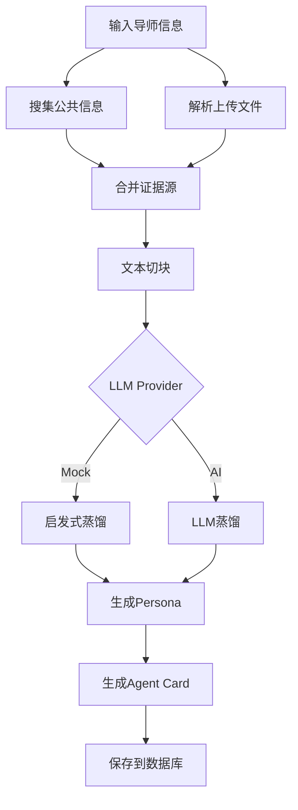
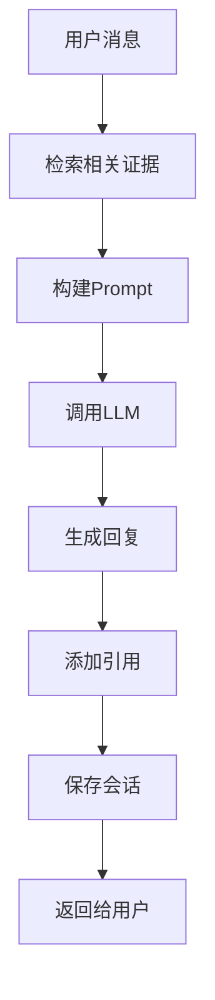
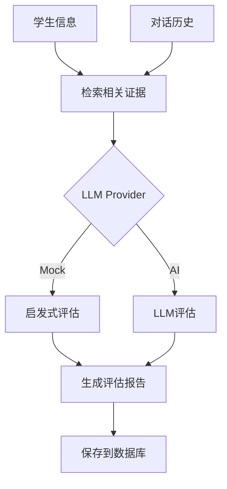

# ScholarBridge 整合项目状态报告

## 项目概述

成功将三个独立开发的组件整合到统一的Next.js项目中：
- **web/**: 前端UI设计
- **supervisor_born/**: AI导师分身构建系统
- **backend/**: Next.js后端服务

## 已完成的工作

### 1. 架构设计 ✅
- 创建了详细的整合分析文档 (`INTEGRATION_ANALYSIS.md`)
- 设计了统一的系统架构 (`ARCHITECTURE.md`)
- 扩展了Prisma schema以支持Persona功能
- 规划了清晰的模块边界和API结构

### 2. 数据模型扩展 ✅
更新了 `backend/prisma/schema.prisma`，新增：
- `Persona` - 导师分身核心模型
- `PersonaUpload` - 上传文件记录
- `PersonaEvaluation` - 学生评估结果
- `PersonaSession` - 聊天会话记录

### 3. Persona核心服务 ✅
创建了完整的Persona服务库 (`backend/lib/persona/`)：
- `types.ts` - 类型定义
- `llm.ts` - LLM提供商抽象（支持mock/anthropic/openai/deepseek）
- `retrieval.ts` - 检索服务（词汇重叠度算法）
- `builder.ts` - Persona构建服务
- `chat.ts` - 聊天服务（RAG增强）
- `evaluation.ts` - 学生评估服务
- `utils.ts` - 工具函数

### 4. API路由 ✅
- `POST /api/personas/build` - 构建Persona
- `GET /api/personas/[slug]` - 获取Persona详情

### 5. 依赖管理 ✅
- 更新了 `backend/package.json`
- 添加了所需的依赖包（cheerio, mammoth, pdf-parse, word-extractor, openai等）

### 6. 配置文件 ✅
- 环境变量模板已准备就绪
- 支持多种LLM提供商配置
- 支持公共搜索API配置

## 技术亮点

### 1. 模块化架构
```
lib/persona/
├── types.ts       # 类型定义
├── llm.ts         # LLM抽象层
├── retrieval.ts   # 检索服务
├── builder.ts     # Persona构建
├── chat.ts        # 聊天服务
├── evaluation.ts  # 评估服务
└── utils.ts       # 工具函数
```

### 2. 多LLM提供商支持
- **Mock**: 开发测试，无需API key
- **Anthropic**: Claude系列模型
- **OpenAI**: GPT系列模型
- **DeepSeek**: DeepSeek系列模型

### 3. 检索增强生成(RAG)
- 词汇重叠度检索算法
- 支持多查询联合检索
- 证据引用和溯源

### 4. 学生评估系统
- 四维度评估：研究匹配度、技术深度、沟通能力、主动性
- 启发式 + LLM混合评估
- 透明的评估依据和推理过程

## 待完成的工作

### 高优先级 (P0)
1. **完成Persona API路由**
   - `POST /api/personas/[slug]/update` - 更新Persona
   - `POST /api/personas/[slug]/chat` - Persona聊天
   - `POST /api/personas/[slug]/evaluate` - 学生评估
   - `GET /api/personas/[slug]/agent-card` - 获取Agent Card

2. **文件上传支持**
   - 实现multipart/form-data处理
   - 集成PDF解析器
   - 集成DOCX解析器
   - 支持图片识别

3. **公共信息搜索**
   - 集成Bing/Google搜索API
   - 集成OpenAlex学术数据
   - 机构主页探测

4. **前端迁移**
   - 将HTML转换为React组件
   - 实现Persona构建UI
   - 实现评估报告展示

### 中优先级 (P1)
5. **完善现有API**
   - 集成Persona到现有聊天API
   - 更新申请流程以支持评估
   - 添加通知触发

6. **数据库迁移**
   - 创建迁移脚本
   - 执行schema更新
   - 数据导入工具

7. **测试**
   - 单元测试
   - 集成测试
   - E2E测试

### 低优先级 (P2)
8. **优化和完善**
   - 性能优化
   - 错误处理增强
   - 日志和监控
   - 文档完善

## 如何使用

### 1. 安装依赖

```bash
cd backend
npm install
```

### 2. 配置环境变量

```bash
cp .env.example .env
# 编辑.env文件，配置必要的环境变量
```

最小配置（使用mock模式）：
```bash
DATABASE_URL="file:./dev.db"
SESSION_SECRET="your-secret-key-minimum-32-characters-long"
PERSONA_LLM_PROVIDER="mock"
NODE_ENV="development"
```

### 3. 初始化数据库

```bash
npm run db:generate
npm run db:migrate
npm run db:seed
```

### 4. 启动开发服务器

```bash
npm run dev
```

服务器将在 http://localhost:3000 启动。

### 5. 测试Persona构建API

```bash
curl -X POST http://localhost:3000/api/personas/build \
  -H "Content-Type: application/json" \
  -d '{
    "name": "张三",
    "affiliation": "清华大学计算机系",
    "title": "教授",
    "authorizedBy": "demo-admin",
    "projectText": "研究兴趣：机器学习、深度学习、自然语言处理。\n\n期望学生：能够独立进行科研，有较强的编程能力。"
  }'
```

### 6. 配置真实的LLM提供商

要使用真实的AI功能，配置相应的API key：

**Anthropic Claude**:
```bash
PERSONA_LLM_PROVIDER="anthropic"
ANTHROPIC_API_KEY="sk-ant-..."
ANTHROPIC_MODEL="claude-3-5-haiku-latest"
```

**OpenAI**:
```bash
PERSONA_LLM_PROVIDER="openai"
OPENAI_API_KEY="sk-..."
OPENAI_MODEL="gpt-4o-mini"
```

**DeepSeek**:
```bash
PERSONA_LLM_PROVIDER="deepseek"
DEEPSEEK_API_KEY="sk-..."
```

## 项目结构

```
ScholarBridge/
├── backend/                      # 主要开发目录（已整合）
│   ├── app/
│   │   ├── api/
│   │   │   ├── auth/            # 认证API
│   │   │   ├── skills/          # Skills管理
│   │   │   ├── applications/    # 申请管理
│   │   │   ├── chat/            # 聊天API
│   │   │   └── personas/        # Persona API (NEW)
│   │   │       ├── build/       # 构建Persona
│   │   │       └── [slug]/      # Persona详情
│   │   ├── (public)/            # 公开页面
│   │   ├── (student)/           # 学生页面
│   │   └── (mentor)/            # 导师页面
│   ├── lib/
│   │   ├── persona/             # Persona服务库 (NEW)
│   │   │   ├── types.ts
│   │   │   ├── llm.ts
│   │   │   ├── retrieval.ts
│   │   │   ├── builder.ts
│   │   │   ├── chat.ts
│   │   │   ├── evaluation.ts
│   │   │   └── utils.ts
│   │   ├── auth.ts
│   │   ├── db.ts
│   │   ├── validation.ts
│   │   └── prompt.ts
│   ├── prisma/
│   │   └── schema.prisma        # 数据库模型（已扩展）
│   └── package.json             # 依赖配置（已更新）
├── web/                         # 前端设计参考
│   └── mentor_student_platform_ui.html
├── supervisor_born/             # AI Agent原始实现（参考）
└── INTEGRATION_ANALYSIS.md      # 整合分析文档
└── ARCHITECTURE.md              # 架构设计文档
```

## 核心功能说明

### Persona构建流程



### 聊天流程



### 评估流程



## API示例

### 1. 构建Persona

```bash
POST /api/personas/build
Content-Type: application/json

{
  "name": "李明",
  "affiliation": "北京大学计算机科学技术学院",
  "title": "副教授",
  "authorizedBy": "dept-admin",
  "projectText": "研究方向：自然语言处理、大语言模型、知识图谱。
正在招募：对NLP和LLM感兴趣的学生，需要有较强的编程能力和数学基础。",
  "publicUrls": ["https://pku.edu.cn/~liming/"],
  "skillId": null  // null表示创建新Skill，否则更新现有Skill
}
```

响应：
```json
{
  "success": true,
  "data": {
    "personaId": "xxx",
    "slug": "li-ming-北京大学计算机科学技术学院-a1b2c3d4",
    "skillId": "xxx",
    "persona": { ... },
    "sourceCount": 5,
    "chunkCount": 37
  }
}
```

### 2. 获取Persona

```bash
GET /api/personas/li-ming-北京大学计算机科学技术学院-a1b2c3d4
```

响应：
```json
{
  "success": true,
  "data": {
    "id": "xxx",
    "slug": "li-ming-北京大学计算机科学技术学院-a1b2c3d4",
    "persona": { ... },
    "agentCard": "# 李明 — Agent Card\n...",
    "buildStatus": "completed",
    "sourceCount": 5,
    "chunkCount": 37
  }
}
```

## 开发指南

### 添加新的LLM提供商

1. 在 `lib/persona/llm.ts` 中实现 `LLMProvider` 接口
2. 更新 `createLLMProvider` 工厂函数
3. 添加环境变量配置

### 自定义检索算法

1. 修改 `lib/persona/retrieval.ts` 中的 `RetrievalService` 类
2. 实现 `rankChunks` 方法
3. 可以替换为向量检索算法

### 扩展评估维度

1. 在 `lib/persona/evaluation.ts` 中添加新的评估维度
2. 更新 `buildEvaluationPrompts` 函数
3. 调整权重计算逻辑

## 测试指南

### 单元测试

```bash
npm test
```

### 特定测试文件

```bash
npm test -- lib/persona/builder.test.ts
npm test -- lib/persona/evaluation.test.ts
```

### 测试覆盖率

```bash
npm run test:coverage
```

## 部署指南

### 开发环境

```bash
npm run dev
```

### 生产构建

```bash
npm run build
npm run start
```

### Docker部署

```bash
docker-compose up -d
```

## 常见问题

### Q: 如何切换LLM提供商？

A: 修改 `.env` 文件中的 `PERSONA_LLM_PROVIDER` 环境变量，并配置相应的API key。

### Q: Mock模式的限制是什么？

A: Mock模式使用启发式算法，不需要API key，但生成的Persona质量较低。仅用于开发和测试。

### Q: 如何处理大文件上传？

A: 需要配置 `MAX_UPLOAD_SIZE_MB` 环境变量，并在Next.js配置中设置body size limit。

### Q: 能否离线运行？

A: 使用Mock模式和本地数据库可以离线运行，但公共信息搜索功能需要网络连接。

## 下一步计划

1. **完成剩余API端点** (1-2天)
2. **实现文件上传功能** (1天)
3. **集成公共信息搜索** (2-3天)
4. **前端页面迁移** (3-5天)
5. **测试和优化** (2-3天)
6. **文档完善** (1天)

## 贡献指南

1. Fork项目
2. 创建特性分支
3. 提交更改
4. 推送到分支
5. 创建Pull Request

## 许可证

本项目遵循MIT许可证。详情请参阅 LICENSE 文件。

## 联系方式

如有问题或建议，请创建Issue或联系维护者。

---

**最后更新**: 2026-04-13
**版本**: 1.0.0-alpha
**状态**: 开发中
